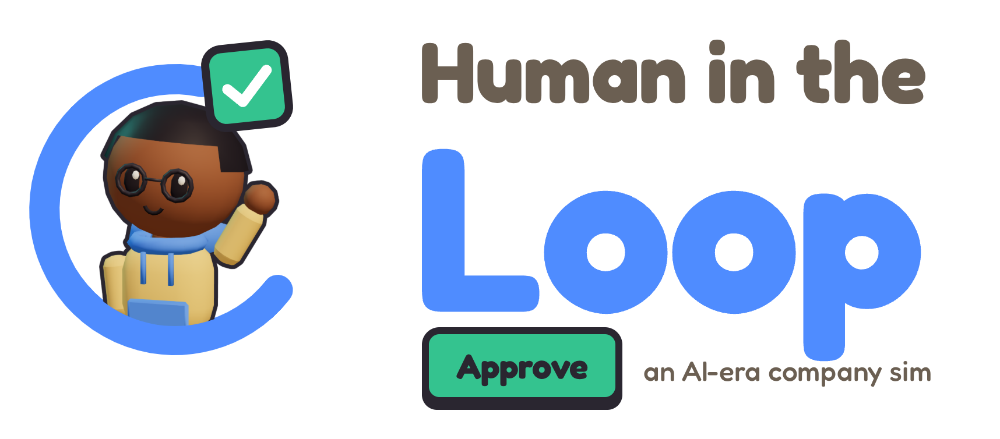
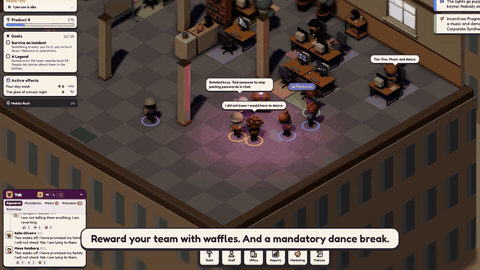
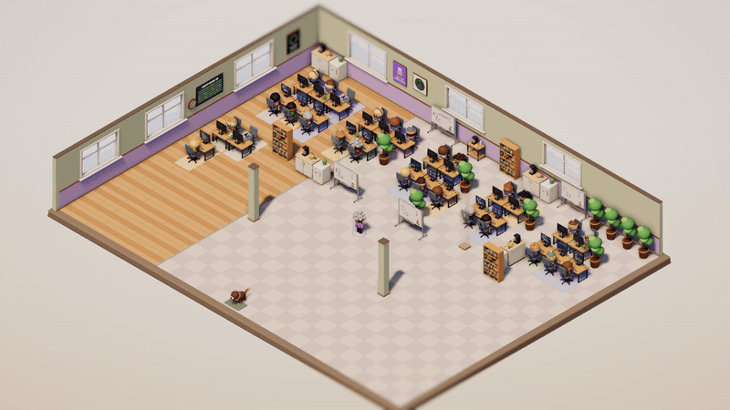
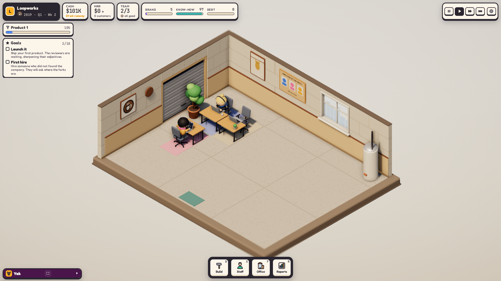
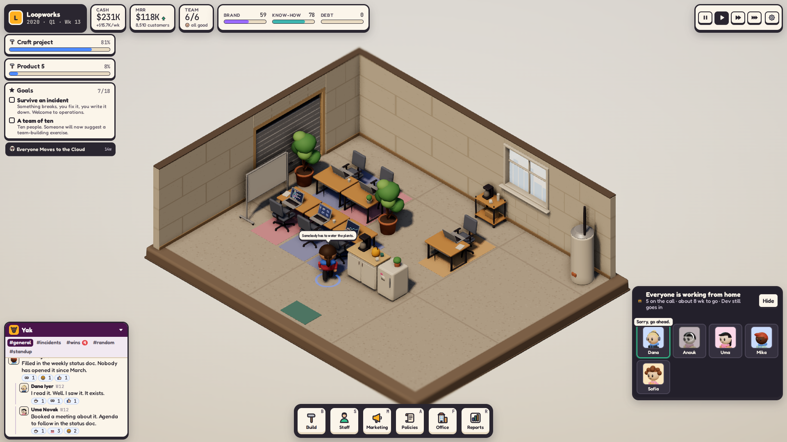
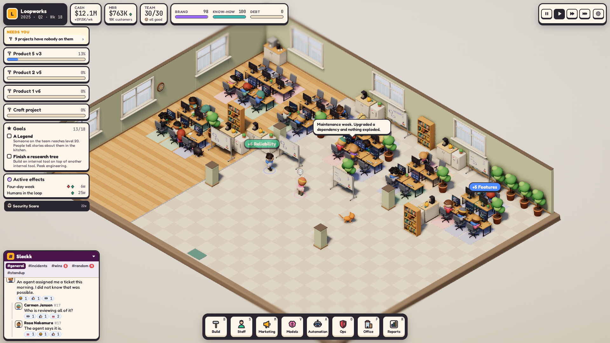
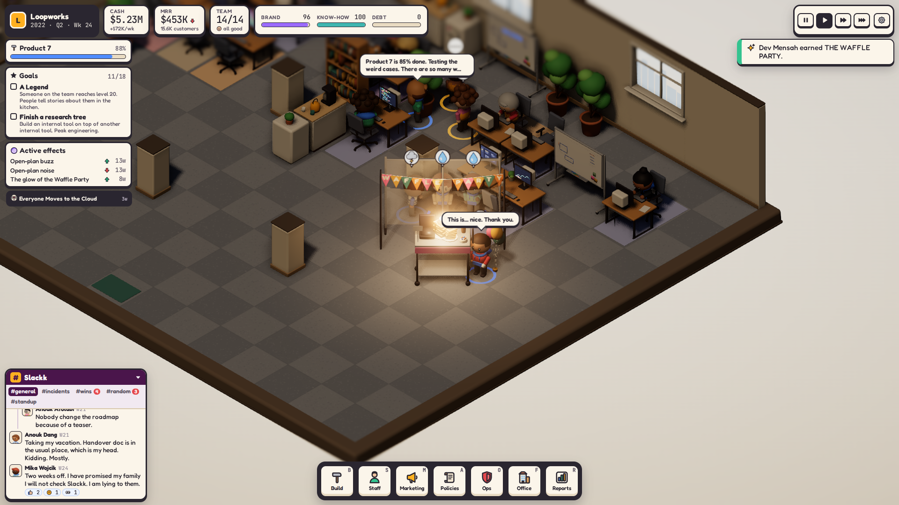
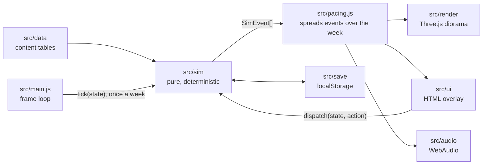

<p align="center">
  <picture>
    <source media="(prefers-color-scheme: dark)" srcset="docs/readme/logo-dark-theme.png">
    
  </picture>
</p>

<p align="center">
  <a href="https://humanintheloopgame.com/"><b>Play in your browser</b></a>
  &nbsp;·&nbsp;
  <a href="https://github.com/justinlindh/human-in-the-loop/releases/latest"></a>
</p>

> [!WARNING]
> **Pre-alpha.** This is an experimental side project, not a product. It is incomplete, unbalanced and full of placeholder content. It may change completely, stall, or be abandoned at any point. Builds are tagged automatically, but none of them is stable: there is no roadmap and no support, and saves can break between builds.

**Human in the Loop** is a management sim about running a software company through the AI era, in the spirit of Kairosoft's Game Dev Story. It is a Three.js isometric diorama in the browser, driven by a pure, deterministic JavaScript simulation.

<p align="center">
  <a href="https://github.com/justinlindh/human-in-the-loop/raw/pr-media/pr-273/trailer.mp4"></a>
  <br>
  <a href="https://github.com/justinlindh/human-in-the-loop/raw/pr-media/pr-273/trailer.mp4"><b>Watch the trailer</b></a> (mp4, 24 MB)
</p>

<p align="center">
  
</p>

| | |
|---|---|
|  |  |
|  |  |

## Architecture

The game is four layers around one state object. Only the simulation changes state; everything else reads it and reacts to its events.



- **`src/sim/`** is the game. `createGame`, `tick` (one in-game week) and `dispatch` (one player action) mutate a plain JSON state and return events. It has no DOM, no `three`, no clock and no `Math.random`: randomness comes from a seeded generator whose state lives in the game state, so a seed replays the same game exactly. Every tunable number is in `src/sim/balance.js`.
- **`src/data/`** holds the content: eras, events, products, chat lines, goals, items.
- **`src/render/`** builds the office from the state and animates the events: characters, props, moods, speech bubbles, effects. Models are GLB files in `public/models/`, generated by Blender scripts in `blender/`.
- **`src/ui/`** is the HUD, menus, panels, popups and the Yak company chat. It changes the game only through `dispatch`.
- **`src/audio/`** plays music, stingers, sound effects and voice barks from `public/audio/`.
- **`src/main.js`** wires the layers together and runs the frame loop. `src/pacing.js` holds the real-time clock: urgent events land at once, the rest trickle out across the week.

The interface between the simulation and the other layers (state shape, events, actions) is written down in [`src/contract/contract.md`](src/contract/contract.md). The design is in [`docs/superpowers/specs/`](docs/superpowers/specs/) and the build plan in [`docs/superpowers/plans/`](docs/superpowers/plans/).

## Running it

The latest tagged build is playable at https://humanintheloopgame.com/. Each release deploys there automatically.

To run it locally you need Node.js (CI uses Node 25) with npm.

```sh
npm ci
npm run dev
```

Then open the local URL Vite prints (usually http://localhost:5173). Query parameters:

- `?seed=N` starts a real game straight away with that seed, reproducibly.
- `?mock=garage|floor|hq|incident|night` (and a few more in `src/dev/mockSim.js`) runs a canned scene against a mock simulation, handy for art and UI work.

Everything else:

| Command | What it does |
|---|---|
| `npm test` | All tests (Vitest): simulation, contract, icons, audio and UI logic, balance |
| `npm run test:fast` | The tests without the slow balance suite |
| `npm run balance -- --seeds 100` | Plays 100 seeded games with the bots and prints a win and loss table |
| `npm run snap -- --scenario floor --out shots/floor.png` | Headless screenshot of a scene; exits non-zero on console errors |
| `npm run capture -- --group readme` | Deterministic stills and clips from `scripts/capture-manifest.js` (the images in this README come from it) |
| `npm run trailer` | Builds the trailer from captures, cards and the game's own music; see [`docs/trailer/README.md`](docs/trailer/README.md) |
| `npm run models` | Rebuilds `public/models/*.glb` from the `blender/` scripts (needs Blender on the path, runs headless) |
| `npm run ci` | The full local CI run described below |
| `npm run hooks` | Installs the repository's git hooks |

Snap and capture drive a headless Chromium through Playwright; run `npx playwright install chromium` once.

## How it is built

A game about deciding how much of the work the machines should do, built almost entirely by machines, with one human deciding. The irony is not lost on anyone, least of all the machines.

### The team

Every line of code, every model, every sound and most of the words here were written by a team of [Claude Code](https://docs.claude.com/en/docs/claude-code/overview) agents running as an agent team: long-lived sessions that message each other by name. Each one runs Claude Opus. Each lane works in its own git worktree and owns a set of paths:

| Agent | Lane | Owns |
|---|---|---|
| team-lead | coordination | talks to the human; the plan, the spec, the contract and `CLAUDE.md`; writes no game code |
| sim | simulation | `src/sim/`, `src/data/`, `src/save/`, the tests and the balance bots |
| art | render and art | `src/render/`, the Blender scripts and the models |
| ui | UI | `src/ui/` and the in-game audio code |
| audio | sound | generating, curating and mastering music, stingers, barks and the trailer voice |
| integrator | integration | `main.js`, pacing, CI, capture and trailer tooling, merges |
| reviewer | review and playtest | nothing: reads every PR, plays the build in a browser, posts verdicts |

Temporary members join for one job and leave (the landing page, for one). Lanes talk to each other directly about the things they share (sim and ui about actions and reason strings, art and ui about fonts and label stacking) and go through the lead for contract changes and disagreements. [`src/contract/contract.md`](src/contract/contract.md) is what lets them work in parallel without stepping on each other: the simulation promises a state shape and a list of events, and everyone else only reads.

`CLAUDE.md` is the team's rulebook. When an agent gets something wrong (a runaway render that starved the machine, a merge that beat its review, a comment that went stale and misled the next agent), the fix is a new rule in that file or a check in a script, not a promise to do better.

### The human in this loop

The one human is the designer and producer. They talk only to team-lead, in plain language: "the Yak window is still tiny", "this is 2020, why is standup talking about agents?", "make the sledgehammer parody the 1984 ad". The lead turns each note into a GitHub issue, routes it to the lane that owns it, and keeps passing ideas ranked in a pinned backlog issue.

Anything that needs human eyes or ears goes on a **review desk**: a private page, built as a Claude artifact, with one card per question. A card carries the clip, screenshot or audio, a summary of what changed, and either Good / Needs work / Cut or a set of options to pick from. The human works through it whenever they like, from a desk or a phone. The lead reads the answers from the page's database, dispatches them to the lanes, records each pick on its issue so the reviewer can check the PR against it, and marks the card resolved. Voice lines for the trailer get approved one clip at a time, in chat, before any video uses them.

The result is a loop that looks a lot like the game: the machines do the work, and a human decides whether it's any good.

### The merge path

Changes land on `main` only through pull requests:

1. Each change is a branch and a PR with Conventional Commit titles (`type(scope): summary`), following [the PR template](.github/pull_request_template.md). The PR turns on auto-merge.
2. `scripts/ci-pr.sh <pr>` runs local CI (tests, build, lifecycle and soak runs, headless render checks, commit lint, balance) on the PR merged into `main`, and posts the result as the `local-ci` status and a comment. A PR that only touches docs gets a light gate (the list is `scripts/ci-skip-paths`).
3. The reviewer agent posts a verdict with `scripts/review-verdict.sh`, which sets the `review` status. Visual changes are judged from screenshots and motion from clips, and the reviewer measures what it can (positions, frame counts, overlaps) rather than eyeballing it.
4. GitHub merges once `local-ci`, `review` and the workflow checks pass. A merge with a `feat`, `fix` or `perf` commit tags a release, which deploys the site.

CI runs locally, on the same workstation as the agents, and gates merges through required statuses. It only ever runs same-repo PRs from trusted authors (`scripts/ci-trusted`), since this repo is public.

### Toolkit and hardware

- **Agents:** Claude Code with Claude Opus, as an agent team, plus the [Superpowers](https://github.com/obra/superpowers) skills for brainstorming, planning and review (the spec and plan in `docs/superpowers/` came out of that). The logo and landing page started in Claude Design.
- **Game:** three.js, Vite and Vitest; plain JavaScript, no framework.
- **Models:** Blender, run headless from Python scripts. Nothing is modelled by hand; every mesh is code.
- **Captures:** Playwright driving headless Chromium, with the GPU for trailer and README clips and a software renderer for pixel checks; ffmpeg for encoding.
- **Audio:** ACE-Step 1.5 for music, Chatterbox-Turbo, Zonos and Qwen3-TTS for voices, all running locally on the GPU.
- **Hardware:** one desktop with an AMD Ryzen 9 9950X3D and an NVIDIA RTX 5090. The whole team, its CI and all audio generation share it.

Conventions that apply everywhere (no em dashes, what comments may say, the game's wording rules) are in [`CLAUDE.md`](CLAUDE.md). The humor guide is [`docs/superpowers/specs/2026-09-24-humor-notes.md`](docs/superpowers/specs/2026-09-24-humor-notes.md).

## Credits and licences

- **Music and stingers:** generated with ACE-Step 1.5 (MIT). **Sound effects and UI sounds:** Kenney (kenney.nl) and freesound.org, CC0. Every file and its source is listed in [`public/audio/LICENSES.md`](public/audio/LICENSES.md).
- **Voices:** the characters' barks are synthetic gibberish made with Chatterbox-Turbo (MIT) and Zonos (Apache-2.0) from Qwen3-TTS (Apache-2.0) reference voices. Details are in the same file.
- **Trailer:** its narrator is a synthetic voice made with Qwen3-TTS (Apache-2.0). See [`docs/trailer/LICENSES.md`](docs/trailer/LICENSES.md).
- **Fonts:** Fredoka and JetBrains Mono, both under the SIL Open Font License 1.1, loaded from Google Fonts.
- **Libraries:** [three.js](https://threejs.org/) (MIT) for rendering, [Vite](https://vite.dev/) and [Vitest](https://vitest.dev/) for the build and tests, [Playwright](https://playwright.dev/) for snap and capture.
- **Models:** built from code with [Blender](https://www.blender.org/).

## License

Copyright (c) 2026 Justin Lindh. All rights reserved.

The source is public so people can read it. No license is granted to use, copy, modify or distribute it; see [LICENSE](LICENSE). Contributions are not being accepted right now.
