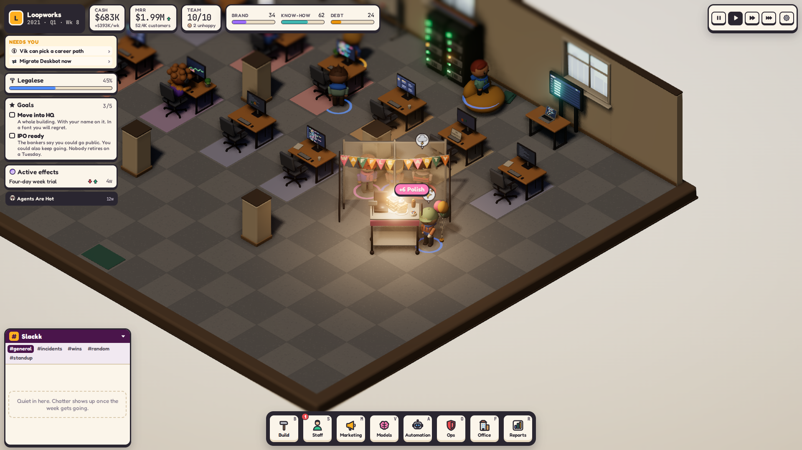

<p align="center">
  <picture>
    <source media="(prefers-color-scheme: dark)" srcset="docs/readme/logo-dark-theme.png">
    
  </picture>
</p>

> [!WARNING]
> **Pre-alpha.** This is an experimental side project, not a product. It is incomplete, unbalanced and full of placeholder content. It may change completely, stall, or be abandoned at any point. There are no releases, no roadmap and no support, and saves can break between commits.

**Human in the Loop** is a management sim about running a software company through the AI era, in the spirit of Kairosoft's Game Dev Story. You hire people, ship products, survive outages and launch parties, and decide how much of the work the machines should do. You are the human in the loop.

A run is a 20-year career, from a garage in 2019 through the AI boom and whatever comes after it. The office is a small isometric 3D diorama that grows with the company; everyone in it has a desk, a mood and opinions in the company chat.

<p align="center">
  
</p>

| | |
|---|---|
|  |  |
|  |  |

## Running it

It runs in the browser. You need Node.js and npm.

```sh
npm install
npm run dev
```

Then open http://localhost:5173. Add `?seed=N` for a reproducible game.

`npm test` runs the simulation and balance tests.

## License

Copyright (c) 2026 Justin Lindh. All rights reserved.

The source is public so people can read it. No license is granted to use, copy, modify or distribute it; see [LICENSE](LICENSE). Contributions are not being accepted right now.
