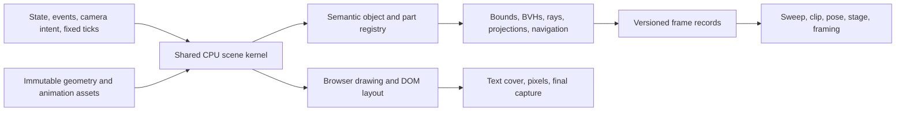

# A scene engine for geometry checks

Build one CPU scene kernel from the game's render modules. Let the browser attach presentation to it, and let checks read immutable frame records from it. Placement, paths, poses, props, pets and robot behavior must stay in those shared modules. A second office simulation would create another source of truth precisely where parity matters most.

The independent prototype lives in `scripts/studio/`. It is an exploration, not a replacement gate. Its capability fields deliberately expose unmet requirements: exact general mesh penetration depth, cross-machine byte identity, semantic identity for every mesh, per-instance transforms, and multiple simultaneous views. DOM layout remains a browser responsibility. Measurements and parity/control results belong in the draft PR and the task report; the commands below reproduce them.

## Compared with the tools spike

The comparison target is [#1124](https://github.com/justinlindh/human-in-the-loop/pull/1124), alongside [#1122](https://github.com/justinlindh/human-in-the-loop/issues/1122). The inspected head is `c9b6db088417a720ca634d77876f52c3c6fa5d1e`. This proposal does not change that PR's files, the existing check tools, or `src/render/`.

| Choice | Tools spike | This approach |
| --- | --- | --- |
| Immediate purpose | Run `sampleMock`, `sampleLoaded` and clip groups unchanged | Define a reusable scene/query boundary and a parseable frame contract |
| Module loading | Vite SSR loader, without listening on a port | Native Node `registerHooks`, with no Vite import on the engine path |
| Presentation | WebGLRenderer replacement and permissive Proxy stand-ins | Narrow renderer/post replacements and explicit DOM/canvas methods; unsupported calls fail |
| Isolation | Page-like process globals | One worker per scene, including clocks, module caches and random state |
| Output | Existing individual check results | Versioned scene records with owners, parts, transforms, joints and optional facts |
| Parity | Sweep violations and clip measurements | Every exported field, matched by id, with numeric tolerance and an uncapped difference report |
| Long-term boundary | Harness compatibility | Extract CPU evolution from renderer construction; delete the adapter afterward |

The tools spike is the smaller route to moving the sweep quickly. Its discovery that `perks.js` initializes a random visit delay before the harness reseeds also explains this prototype's unmodified parity failure. Merely reseeding after model readiness cannot reset a number already stored in a closure. Both approaches need the render-side fix. This prototype adds a controlled experiment that substitutes a fixed initial delay in both environments in memory, separately from the unchanged-code report.

The proposal favors the shared kernel, while retaining the tools spike's existing domain checks as consumers. A schema is useful only if every consumer agrees on its units, identity rules, omissions and provenance. It should not force sweep tolerances or pose judgments into the engine.

## Shared kernel and responsibilities



The proposed API is `createScene({ assets, state, eventLog, random, cameraIntent })`, `stepTo(tick)`, `sample(query)` and `dispose()`. The kernel owns the update ordering now expressed by `createRenderer().render(dt, { draw: false })`: camera intent, office, staff and moments, effects, props, then world matrices. The browser consumes that same result before postprocessing and label layout. Neither drawing, query selection, material compilation, fonts nor texture callbacks may advance behavior.

The prototype calls the real `createRenderer`, `sync` and `render(..., { draw: false })`; it does not reimplement their update loop. Native import hooks replace only presentation construction and supply `import.meta.env`. A read-only factory wrapper retains character handles so queries call the actual `joints()` method, including its special wrist calculation. The wrapper does not substitute a rig or copy joint equations. Browser parity applies the same wrapper through a request route. The production API should expose those handles directly.

The strict adapter still runs canvas paint instructions against a no-op 2D context. It reports zero text width and makes no DOM layout claim. An `Image` stand-in is necessary even without texture pixels: `office.js` conditions construction of framed era emblems on the presence of `Image`. Omitting it removes real meshes. Models load from local `public/` files through the normal `GLTFLoader`; network URLs and path traversal are refused, and missing required templates fail the scene. Unsupported GPU work, such as an offscreen portrait requested by an untested moment, must fail instead of quietly producing an incomplete pass.

State is frozen while render time advances in 1/30-second ticks. `--seed N --week W` uses the real simulation and balanced bot to obtain that state; it does not recreate a historical renderer at week W. A JSON or gzip snapshot supplies the same input boundary. A pending decision is announced once. Replaying an ongoing game, including paced events, requires an explicit event/command log in the production API. A saved simulation state alone contains neither past walking paths nor renderer timers.

### Existing primitives to reuse

| Primitive | Use and constraint |
| --- | --- |
| `AnimationMixer`, character `update` and `joints()` | CPU pose evolution; no skeleton recreation in the check |
| `Object3D.updateMatrixWorld` | Required after every tick, even if no query or draw follows |
| `Box3.setFromObject(object, true)` | Tight vertex bounds where needed; prototype uses cheaper transformed local AABBs for static/baked parts |
| `Mesh.getVertexPosition`, `SkinnedMesh.applyBoneTransform` | CPU vertex deformation before projections or geometry extraction |
| `StaticGeometryGenerator` | Bake posed skinned/morphing geometry into a query-owned world-space mesh |
| `MeshBVH.intersectsGeometry` | Triangle surface crossing, including a thin slab with no enclosed vertices |
| `closestPointToGeometry` | Surface separation; the prototype bakes both operands into world space so nonuniform scaling does not corrupt units |
| `Raycaster` with indirect BVHs | Landmark blockers while retaining Three.js material-side and layer behavior |
| `projectTriangles` from the pose tool | Near-plane and viewport clipping when the fast all-vertices-inside path cannot apply |
| Office `nav()` and `obstacles()` | Export the game's actual walk grid and obstacle owners |

The [three-mesh-bvh API](https://github.com/gkjohnson/three-mesh-bvh/blob/master/API.md) documents crossing, nearest-point and geometry-baking operations. These operations do not themselves define a general solid's minimum translation depth. The prototype uses the versions in the lockfile and indirect BVHs, avoiding changes to the game's triangle indices.

## Determinism is an input contract

The production key must contain the canonical state, render epoch or checkpoint, event/command log, integer tick, camera intent, rig/quality policy, source hash, geometry hash, dependency hash, and random protocol version. Repeated queries at a tick must be observations. Skipping queried frames must still execute every intervening tick.

Required render changes:

1. Give behavior a dedicated deterministic stream before constructors execute. Prefer keyed draws over `(state seed, actor id, event id, purpose, occurrence)` so adding another actor or a decorative object cannot shift a reaction. Keep this separate from the sim RNG.
2. Audit all behavior uses in `sync`, `perks`, `moments`, `incentives`, `pets` and `robot`, including initial timers. `character` has a fallback random source too. `fx` is cosmetic, but cosmetic geometry can block queries and still needs a defined seed if exported. `prints` already isolates some construction draws; global UUID consumption must become irrelevant everywhere.
3. Replace `array.sort(() => Math.random() - 0.5)` with a seeded shuffle. A random comparator is not a valid ordering and can behave differently with another sorting implementation. Sort ownership lists explicitly by stable semantic id.
4. Inject integer ticks. Avoid wall clocks and asynchronous readiness affecting decisions. Finish asset hydration before the render epoch begins. Camera and view-dependent staging are explicit inputs rather than a consequence of whether the frame was drawn.
5. For the literal promise of identical bytes on every machine, pin deterministic numeric implementations, including transcendental functions, geometry generation and ordering. A portable deterministic math/geometry core or fixed-point evaluation is needed, then an architecture/OS test matrix. Rounding native `Math.sin` results is not proof of that promise.

The prototype seeds the legacy game and tool streams, runs measurements on the tool stream, sorts JSON keys, and quantizes numbers to 1e-6. Separate workers prevent cache and clock leakage. Its verification covers identical output with different query schedules and serial versus parallel execution on one environment. It explicitly reports `crossMachineByteIdentity: false`. [#1121](https://github.com/justinlindh/human-in-the-loop/issues/1121) fixes important reaction picks but its permission for cosmetic randomness is narrower than the full byte-identity requirement here.

## Frame contract

`scene.mjs` emits one JSON object per line, including with `--json`. All frames are self-contained; no consumer has to replay deltas. The prototype schema is `hitl.scene/0.1`. Production v1 should be introduced only after semantic identity and unsupported measures are resolved.

| Field | Meaning |
| --- | --- |
| `schema`, `frame`, `timeSeconds`, `stepHz` | Schema id and absolute render time; CLI seconds must align with the 30 Hz tick |
| `provenance` | SHA256 of input state bytes after parsing, source contents, model contents and lockfile; quality, rig, random protocol and diagnostic override |
| `state` | Input week and office stage, for identification rather than reconstruction |
| `capabilities` | Explicit limits that consumers must check before judging a rule |
| `objects[]` | Stable owner id, `person|item|prop|wall|pet|robot`, nullable staff/item/placed owner ids, world matrix, bounds, visibility and mesh parts |
| `parts[]` | Part id/name, world matrix, world AABB, visibility and instance/skin flags |
| `person` | Ten world joint positions from `joints()`, activity, walk mode/path/goal/temp state, target, and held-object ids |
| `cameras[]` | Current camera id/type, column-major world and projection matrices, CSS viewport width/height |
| `facts.intersections[]` | Part ids, triangle crossing, containment, `depthM`, depth status, and vertex-witness depth lower bound |
| `facts.clearances[]` | Person/item pair, the closest tested part pair, and minimum solid separation within 0.5 m |
| `facts.people[]` | Per selected person, head projection and/or seven landmark rays with origin, target, on-screen state, visibility, blocker part id and hit distance |
| `facts.occupancy` | Grid dimensions, cell size, world origin, blocked bytes in `x + z*nx` order, and obstacle rectangles with owners |

World units are metres, Y is up, matrices use Three.js column-major order, and quaternions can be recovered from the world matrix. Screen rectangles use CSS pixels with origin at the viewport's top left. Bounds are transformed local AABBs, conservative under rotation; they are not mesh penetration. Hidden source furniture meshes remain available for physical queries because drawing batches hide the originals. Draw-batch geometry also appears in the inventory as `environment-or-draw-batch`, but is excluded from physical pair tests to avoid double-counting.

People and items have semantic ids. Unnamed environment geometry uses structural paths; part indices are stable only for the same build/topology, and held-object paths may change on reparenting. Pets use the state list order as the prototype association. These are explicit prototype limits, not a production identity guarantee. The render lane should preserve an owner/part id through baking and batching and expose each instance transform. The prototype lists an `InstancedMesh` as an aggregate; its part bounds do not describe all its instances. A rule needing those bounds must reject that capability.

`--who` selects exported people and subject queries, while other scene geometry remains available as blockers. Physical pairs involving no selected subject are skipped. Missing requested subjects fail. `--facts` requests only named families; absence means unrequested, never zero. Null means unavailable, not pass. Non-finite numbers fail serialization. Output has no UUIDs, wall timestamps, process ids, filesystem paths or timings. Profiling goes to a separate file.

### Depth and geometry limits

`surfaceCrossing` is a triangle test, within floating-point tolerances. `containment` uses bidirectional odd/even rays and assumes closed solids; disconnected or nonmanifold meshes need validation and component-aware containment before use as a gate. Tangential contact is not assigned a positive penetration automatically.

`depthM` is null with `general-solid-depth-unavailable`. `vertexDepthLowerBoundM` is a sampled interior-witness distance, assuming closed solids; it can be zero for a deeply crossing thin desk. It is not an exact penetration depth. This is an unmet requirement, rather than a renamed crossing extent. The thin-surface work in #1116 improves the sweep's sensitivity using crossing-curve reach, but reach also is not a minimum translation distance.

The recommended v1 definition is minimum separating translation for validated convex collision pieces, with an explicit error bound for numerical solves. Arbitrary nonconvex mesh pairs need a separate specified method and potentially expensive computation. Keep exact triangle crossing as an independent fact so an unavailable or underestimated depth cannot conceal a collision. Art and tools should agree whether a rule really needs minimum translation, surface clearance, crossing extent, or a sampled interior distance before migrating its threshold.

The prototype's clearance is minimum distance between physical parts, with zero for detected overlap/containment. Its rays use opaque mesh geometry, not texture alpha, smoke, shadows or DOM. The facial targets reuse the pose tool's neutral bare-head landmarks; facial ink is excluded as in that tool. Seven visible points do not imply that every pixel of a face is visible. The camera array contains only the active view. Production multi-view sampling needs camera/cutaway evaluation without advancing staff or changing their plans.

## Query and process interfaces

```sh
node scripts/studio/scene.mjs --mock floor --from 0 --to 2 --every 0.2 --who s1,s3 --facts occupancy,projections,visibility --json
node scripts/studio/scene.mjs --snapshot saved.json.gz --from 2 --facts intersections,clearances --json
node scripts/studio/scene.mjs --seed 1 --week 112 --from 1 --rig --json
node scripts/studio/batch.mjs --input requests.json --jobs 2
```

`requests.json` is an array such as `[{"mock":"floor","frame":60,"facts":["occupancy"]},{"seed":1,"week":112,"frame":60}]`. Batch output remains in input order. Each request gets a worker and a fresh render epoch; `jobs` limits concurrency without any render-slot lock.

```js
import { openScene, sampleMany } from '../../scripts/studio/index.mjs';
const scene = await openScene({ mock: 'floor' });
try {
  const { result, timing } = await scene.sample(60, { facts: ['visibility'], who: ['s1'] });
  consume(result);
} finally {
  await scene.close();
}
```

The CLI uses seconds; the library uses integer frame numbers. Sampling backward is an error; open a fresh scene to rewind. Node with synchronous `registerHooks` is required. No dependencies or package scripts are added. The browser comparison and benchmark are separate commands and intentionally retain the existing browser harness's render lock.

## Validation and measurement

`controls.mjs` plants thin desks at negative and positive intrusions through both a box proxy and a live game head, a fully contained mesh, several known gaps, an eye-covering hand proxy, a wall in front of facial landmarks, offscreen and viewport-spanning projections, and a walk-grid obstacle. Negative controls remove or separate the blocker. The control report explicitly lists the unavailable exact-depth assertions.

`verify.mjs` checks joint coverage, id uniqueness, rewind/missing-subject errors, seeded state creation, lifecycle errors, observer independence and identical serial/parallel records. For CPU skinning, authored-rig smoke coverage is useful but is not a substitute for a deforming `SkinnedMesh` control and bone-by-bone browser parity before v1.

```sh
node scripts/studio/controls.mjs --out controls.json
node scripts/studio/verify.mjs
node scripts/studio/compare.mjs --mock floor --out parity-floor.json
node scripts/studio/compare.mjs --snapshot saved.json.gz --out parity-save.json
node scripts/studio/compare.mjs --mock floor --control-perk-delay 3 --out parity-control.json
node scripts/studio/bench.mjs --runs 3 --frames 15 --out benchmark.json
```

Comparison uses the same state and a 1600x1000 viewport, Low quality and procedural rig in the existing harness, with actual WebGL draw auditing. It compares all exported fields at frames 0, 1, 30, 65, 90, 180 and 600 by default, at absolute tolerance 1e-5. It exits 1 on any mismatch and writes every difference without truncation. Add `--facts intersections,clearances,visibility,projections,occupancy` for the full fact comparison. `--trace-random` diagnoses random consumption separately and is excluded from benchmarks. A fixed initial-delay control is not proof that unmodified game code has parity.

The real snapshot used for the report is the event finder's pre-tick saved state for seed 1, balanced bot, event week 112: input week 111, Office Floor, six staff. Obtain it with `node scripts/events/find.js --where "e.type === 'week' && s.officeStage === 1" --seed 1 --bot balanced --limit 1 --json`; use the returned `snapshotFile`. No machine-specific cache path is embedded in the prototype.

Benchmark workloads separate inventory, projection/occupancy, visibility, intersections, and all facts. Each runs in a fresh scene with 30 warm-up ticks. Report Node process-to-output time, worker readiness, browser readiness including Vite and lock time, in-process step/query costs, and transport/serialization round trips separately. The benchmark uses the explicit delay control so both sides measure identical scenes. It is a shared-machine sample, not an isolated hardware claim. Neither a fast inventory query nor a cold-start improvement establishes the 10 ms target for all-pairs depth and clearance work.

To reduce expensive query cost, preserve immutable local BVHs, update only changed pose geometry, index broad-phase bounds spatially, cache static pairs, restrict face rays to requested subjects, and transport static geometry/ownership once per stream. The prototype uses indirect ray BVHs, world-geometry and static-pair caches, and AABB pruning of nearest furniture queries. Repeated source/model hydration across states remains until the kernel exposes a complete reset boundary.

## Checks that stay in the browser

Speech bubbles, names, labels, leader lines and emoji require actual font shaping, CSS widths, wrapping, clipping and overlay placement. A zero-width canvas stand-in must never satisfy a cover rule. Keep `faceCovered`, bubble collision and text readability checks in the browser. Measured font metrics alone are insufficient for CSS layout parity; a deterministic text-layout library with pinned fonts, shaping and wrapping would be a separate project.

Pixel appearance, transparency/alpha textures, lighting, shadows, postprocessing, screenshots and the final recording also remain browser work. Capture planning can use geometry for head size, subject positions and framing, then check the DOM and draw the approved shot once. Geometric visibility cannot establish an attractive or readable composition.

## Migration and render-side work

Estimates are engineering effort ranges, not elapsed delivery promises. Nothing switches gates as part of this prototype.

| Order | Owner and change | Estimate | Acceptance |
| --- | --- | --- | --- |
| 1 | Art: inject behavior randomness before construction, including initial perk timer; replace random comparator shuffles | 1-2 days | Unmodified Node/browser parity past initial visits; repeated reaction choices; draw on/off control |
| 2 | Art: extract CPU scene construction and stepping from WebGL/post/DOM wiring; expose character and semantic owner registry | 2-4 days | Delete loader/factory instrumentation; no duplicated placement or update equations |
| 3 | Art + tools: owner/part ids through baking/batching, per-instance geometry and bounds, camera/cutaway query API | 2-3 days | Stable ids across attach/detach; all four views; known instances present |
| 4 | Tools: schema v1 validation, provenance, errors and worker reuse/reset | 1-2 days | Repeated states and mixed query order cannot leak caches or alter output |
| 5 | Art + tools: define depth; validate closed collision components and implement the chosen exact/tolerance-bounded metric | 3-5 days, then reassess | Thin slabs at known depths, containment, nonuniform scale, tangency, nonconvex and skinned controls |
| 6 | Tools: move sweep geometry passes, then clip pair/triangle measures | 1-2 days each | Old and new measurements compared field by field; identical decisions and explained metric changes |
| 7 | Art: move scene pose joints, landmark rays, held geometry and stage geometry specs | 1-2 days | Retain DOM cover path; replay all relevant moments with positive/negative controls |
| 8 | Video + tools: consume frame records for capture setup, head size and safe camera framing | 1 day | Browser confirms text layout and final image; capture still uses the real draw path |
| 9 | Integrator: CI tiers and portable determinism matrix | 1-2 days for gates; 3-5 days to prototype portable math, then reassess | Native control gate per PR; browser parity for render/kernel/asset changes and periodically across fixture corpus |

Sweep should migrate first because its geometry passes already use renderer data and dominate repeated snapshot work. Clip follows once the metric contract preserves its crossing fraction. Pose and stage split geometry from DOM rather than dropping their text checks. Cover retains browser text layout. Capture consumes geometry records for planning, with browser recording and visual review intact.

CI should run cheap controls and schema/observer checks for every relevant change. A stratified corpus should include mocks, saved states, staged props, visitors, pets, robot, authored animation, hidden parts, moved furniture and four views. Run drawing-off browser parity on affected render/kernel/model changes and periodically over the larger corpus; also retain a smaller drawing-on parity control for GPU-resource side effects. Performance gates should measure fixed workloads and compare a baseline, not enforce a noisy wall-clock threshold on an occupied machine. Cross-machine byte identity needs separate architecture/OS runners and a deterministic numeric implementation before that capability can become true.
